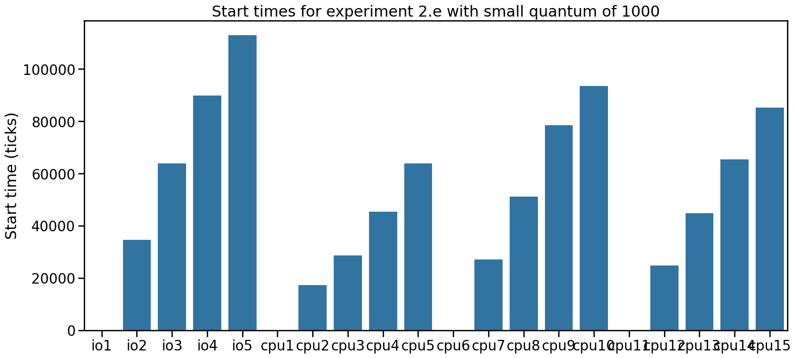

# Informe laboratorio 3: Planificador de Procesos

### Integrantes: María José Aranda, Martín Nicolás Contrera, Juan Narvaez

## Primera Parte: Estudiando el planificador de xv6-riscv

### 1. ¿Qué política de planificación utiliza xv6-riscv para elegir el próximo proceso a ejecutarse?

La politica de planificacion que usa xv6-riscv es la de **Round Robin** (RR), esto se puede ver en kernel/proc.c en la funcion scheduler() en donde chequea constantemente en la lista de procesos aquellos procesos que están en el estado RUNNABLE para ejecutarlos.

### 2. ¿Cúales son los estados en los que un proceso puede permanecer en xv6-riscv y qué los hace cambiar de estado?

Los estados en los que puede estar un proceso son la de UNUSED, USED, SLEEPING, RUNNABLE, RUNNING, ZOMBIE, y los hace cambiar de estado es el scheduler y algunas funciones del kernel/proc.c como `exit()` que los cambia a ZOMBIE, `sleep()` que los cambia a SLEEPING, `wakeup()` que los cambia a RUNNABLE, `yield()` que los cambia a RUNNABLE, `scheduler()` que los cambia a RUNNING, `procinit()` que los inicializa en UNUSED, `allocprop()` que los cambia a USED, y `freeproc()` que los cambia a UNUSED.
    
### 3. ¿Qué es un *quantum*? ¿Dónde se define en el código? ¿Cuánto dura un *quantum* en xv6-riscv?
_Pista_: Se puede empezar a buscar desde la system call `uptime` o leyendo la documentación de xv6 en la sección de interrupciones.

Un quantum (o time slice) es el periodo de tiempo fijo maximo en el que un proceso puede estar ejecutandose hasta que se interrumpa y ejecute otro proceso, se define en kernel/start.c en la funcion `timerinit()`, donde se especifica que un quantum en xv6-riscv dura 1000000 ciclos (1/10 segundos en qemu aproximadamente).

### 4. ¿En qué parte del código ocurre el cambio de contexto en xv6-riscv? ¿En qué funciones un proceso deja de ser ejecutado? ¿En qué funciones se elige el nuevo proceso a ejecutar?

La parte del codigo donde ocurre el cambio de contexto en xv6-riscv es en el kernel/swtch.S con la funcion `swtch()`, y es en kernel/proc.c donde un proceso deja de ser ejecutado en las funciones `yield()`, `freeproc()`, `exit()`, `sleep()`, y en donde un nuevo proceso se ejecuta con la funcion `scheduler()`.

### 5. ¿El cambio de contexto consume tiempo de un *quantum*?
  
El cambio de contexto consume tiempo pero no de un quantum, sino generalmente uno bastante menor.

## Segunda Parte: Medir operaciones de cómputo y de entrada/salida

### Experimento 1: ¿Cómo son planeados los programas ioboundn y cpubound?

#### Responder las siguientes preguntas utilizando gráficos y/o tablas para justificar sus respuestas:

#### 1. Describa los parámetros de los programas cpubench e iobench para este experimento (o sea, los define al principio y el valor de N. Tener en cuenta que podrían cambiar en experimentos futuros, pero que si lo hacen los resultados ya no serán comparables).

Para la ejecución de los programas cpubench e iobench del experimento 1 decidimos usar los siguientes parámetro y valores:
Quanto = 100000, N = 10, CPU_EXPERIMENT_LEN = 256, IO_EXPERIMENT_LEN = 512, CPU_MATRIX_SIZE = 128, IO_OPSIZE = 64

#### 2. ¿Los procesos se ejecutan en paralelo? ¿En promedio, qué proceso o procesos se ejecutan primero? Hacer una observación cualitativa.

Si, los procesos se ejecutan en paralelo, y los procesos que se ejecutan primero son los del tipo cpubound, los cuales se ejecutan todos los de ese tipo en paralelo y luego todos los procesos de tipo iobound en paralelo, esto se puede ver en el start_tick en donde este valor es mas alto para los procesos iobound (ver gráfica).

Gráfico 1:  comparación entre tiempo de inicio y finalización de ejecución entre procesos que corren en paralelo. 1 iobound y 3 cpubound.


#### 3. ¿Cambia el rendimiento de los procesos iobound con respecto a la cantidad y tipo de procesos que se estén ejecutando en paralelo? ¿Por qué?

Si, cambia el rendimiento tanto respecto a la cantidad como al tipo de proceso que se esté ejecutando, a mas cantidad de procesos a ejecutar, mas va a tardar en finalizar la ejecución de todos los procesos, y en el caso de procesos iobound, depende de si solo se ejecutan procesos iobound o también procesos cpubound, en este último caso tomará aun mas tiempo la ejecución de todos los procesos ya que primero deberá ejecutar los procesos cpubound. Como se puede observar en el gráfico 2, cabe destacar que si bien los procesos iobound tardaran mas en ejecutarse, estos al momento de iniciarse o retomar su ejecucion, parece que siguen utilizando la misma cantidad de tiempo de cpu que en las ejecuciones sin otros procesos en paralelo.

Gráfico 2: tiempo que paso entre inicio y finalizacion de cada proceso.


#### 4. ¿Cambia el rendimiento de los procesos cpubound con respecto a la cantidad y tipo de procesos que se estén ejecutando en paralelo? ¿Por qué?

Si, cambia el rendimiento tanto respecto a la cantidad como al tipo de proceso que se esté ejecutando, a mas cantidad de procesos a ejecutar, mas va a tardar en finalizar la ejecución de todos los procesos, y en el caso de procesos cpubound, depende de si solo se ejecutan procesos cpubound o también procesos iobound, en este último caso tomará aun mas tiempo la ejecución de todos los procesos ya que deberá además ejecutar procesos iobound al último.


#### 5. ¿Es adecuado comparar la cantidad de operaciones de cpu con la cantidad de operaciones iobound?

No, no es adecuado comparar la cantidad de operaciones de cpu con la cantidad de operaciones iobound principalmente debido al tipo de proceso con el que estamos trabajando, además de que los programas no solo son distintos sino que tienen valores y constantes distintas adecuadas para el tipo de operación que realiza.

### Experimento 2: ¿Qué sucede cuando cambiamos el largo del quantum?

#### 1. ¿Fue necesario modificar las métricas para que los resultados fueran comparables? ¿Por qué?
 Con el quantum = 10000, no fue necesario modificar las métricas. Porque se respetan las reglas previamente escritas, como que los valores no sean cercanos a 1.

 Con el quantum = 1000, si hizo falta modificar las métricas, estas se achicaron por la mitad para que los experimentos en un tiempo similar a los demas.

#### 2. ¿Qué cambios se observan con respecto al experimento anterior? ¿Qué comportamientos se mantienen iguales?
En general todos los procesos requieren mas ticks para completarse. Se mantiene que en cuanto a la ejecucion en paralelo se observa que para los procesos iobound es poca la diferencia entre 1 proceso solo o varias en paralelo.
Para los procesos cpubound ejecutar 1 solo procesos o varios en paralelo produce una diferencia grande entre la cantidad de tiempo que tardar lo que se ve reflejado en la cantidad de ticks que requieren.

Tambien sigue el hecho de que el planificador da prioridad a que se ejecuten los procesos cpubound sobre los iobound.


#### 3. ¿Con un quantum más pequeño, se ven beneficiados los procesos iobound o los procesos cpubound?
Con un quantum mas pequeño como 1000, se ven beneficiados los procesos iobound ya que se notan mucha menos diferencia de cuando comienzan a ejecutarse en comparacion a los procesos cpubound.





---

## Tercera Parte: Asignar prioridad a los procesos

Primeramente agregamos la constante **NPRIO** en el archivo `param.h` donde se encuentran todas las constantes. En este caso, se definen tres niveles de prioridad (0 es la más baja y NPRIO-1 es la más alta). Luego modificamos `struct proc`, en el archivo `proc.h` para incluir 2 nuevos campos:
 - **priority** que representa la prioridad del proceso 
 - **sch_choosen** que describe la cantidad de veces que el planificador eligió el proceso para ejecutarlo.
 Para asegurarnos que los procesos se inicien con la prioridad más alta, modificamos la función `allocproc`.  Al crear un nuevo proceso, `allocproc` ahora asigna el valor `NPRIO - 1` a `priority`, indicando que los procesos comienzan con la prioridad más alta.
Particularmente, la prioridad cambia según el comportamiento del proceso.
### Descenso de prioridad  
Si un proceso consume todo el quantum realizando cómputo, su prioridad disminuye. Para implementar esto, se modificó la función `yield`, encargada de liberar el CPU cuando un proceso termina su quantum. En `yield`, se verifica si la prioridad actual es mayor que 0, en cuyo caso se decrementa:
```c
void
yield(void)
{
 struct proc *p = myproc();
 acquire(&p->lock);
 if(p->priority > 0)
   p->priority --;
 p->state = RUNNABLE;
 sched();
 release(&p->lock);
}

```

### Ascenso de prioridad 
Si un proceso se bloquea antes de consumir todo su quantum, su prioridad se incrementa. Este cambio se realizó en la función `sleep`, que se invoca cuando un proceso se bloquea por falta de recursos. Aquí se verifica si `priority` es menor que `NPRIO - 1`, incrementándola en caso afirmativo:
```c
void
sleep(void *chan, struct spinlock *lk)
{
 struct proc *p = myproc();
 acquire(&p->lock);  
 release(lk);
 p->chan = chan;
 p->state = SLEEPING;
 if(p->priority < NPRIO-1)
   p->priority++;


```
## Mediciones con la implemtación de MLFQ

#### Lista de experimentos
A iobench 5 &

B iobench 5 &; iobench 5 > iob2.txt &; iobench 5 > iob3.txt &

C cpubench 5 &

D cpubench 5 &; cpubench 5 > cpud2.txt &; cpubench 5 > cpud3.txt &

E iobench 5 &;cpubench 5 > cpue2.txt &; cpubench 5 > cpue3.txt &; cpubench 5 > cpue4.txt &

F cpubench 5 &;iobench 5 > iof2.txt &; iobench 5 > iof3.txt &; iobench 5 > iof4.txt &

Con las graficas de los experimentos A y B, C y D, podemos ver que se mantiene el comportamiento de que correr 1 solo proceso los tiempos que de procesamiento son muy similares y cuando se corren 3 en paralelo estos tiempos varian un poco pero en promedio son muy parecidos a correr 1 unico proceso ya sean iobound o cpubound.

#### Experimentos A y B q=100000


#### Experimentos C y D q=100000


Para la comparacion entre correr en paralelo 1 proceso iobound con 3 cpubound no hay ninguna diferencia notable.
#### Experimento E q=100000


Cuando nos fijamos en los tiempos del experimento f de correr en parelelo 1 proceso cpubound con 3 procesos iobound, podemos notar que los procesos cpubound tuvieron un aumento ligero en el tiempo de inicio de ejecucion y pero se mantiene la uniformidad de los ticks de procesamiento. Y para el proceso cpubound se mantuvo con valores muy parecidos.
#### Experimento F q=100000


#### Experimento E q=10000


#### Experimento F q=10000


En los experimentos E y F con un valor de quantum 100 veces menos hay algunos cambios pequeños. En el E 2 de los procesos cpubound aumentaron ligeramente su tiempo de inicio de ejecucion, mientras que en el experimento F 1 de los procesos iobound disminuyo muy poco su tiempo de inicio de ejecución.

#### Experimento E q=1000


#### Experimento F q=1000


#### Para realizar las gráficas utilizamos python con algunas librerías y los datos de ejecuciones copiados en la siguiente hoja de calculo:

https://docs.google.com/spreadsheets/d/1bAmrx0s1Jqz0VTXjkAZ2zelZIVX-Iv1O21DyvRMyukg/edit?pli=1&gid=525358742#gid=525358742

### ¿Produce starvation?
Sí, esta implementación puede producir starvation. Esto puede ocurrir si un proceso de baja prioridad está esperando para ejecutarse, y luego llega otro proceso de mayor prioridad que realiza operaciones I/O. En tal caso, se seleccionará al de mayor prioridad y no al que ya estaba esperando. Con el tiempo, si esta situación se repite, ese proceso permanecerá en estado RUNNABLE sin ser seleccionado para su ejecución.Para los experimentos E y F con un valor de quantum 10 veces menos no hay ningun cambio considerable entre los comportamientos de los planificadores round robin y mlfq.
